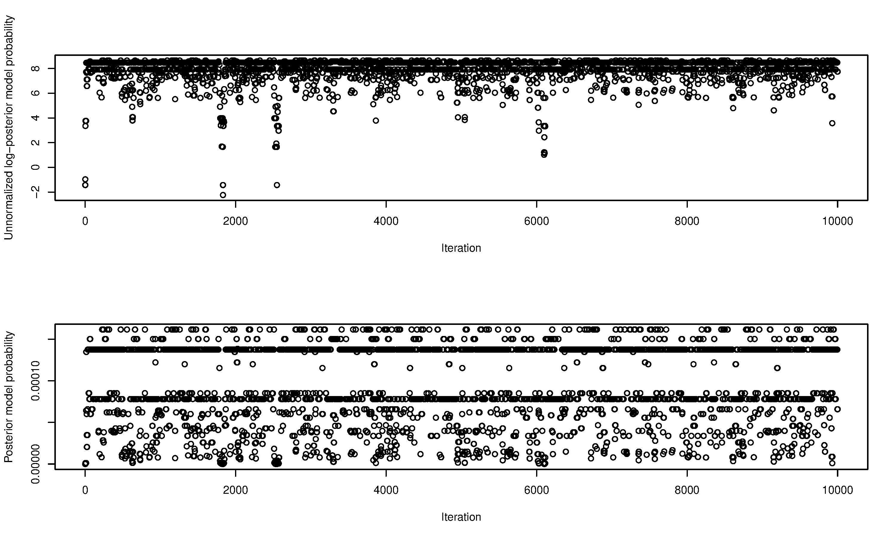
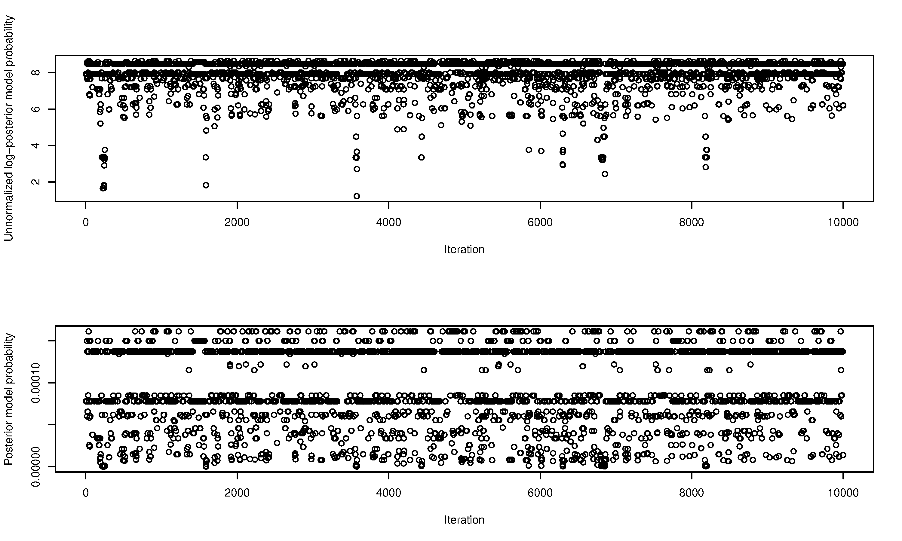

# README for doublethink-mcmc

This code is released to coincide with publication of **Identifying direct risk factors in UK Biobank via simultaneous Bayesian-frequentist model-averaged hypothesis testing using Doublethink (2025)** by Nicolas Arning, Helen R Fryer and Daniel J Wilson (2026) [*PNAS* 123(1): e2514138122](https://www.pnas.org/doi/full/10.1073/pnas.2514138122).

## Pre-requisites
Install and run Docker with root privileges. On machines without root privileges, Apptainer might be an option.

Edit the following line in slurm.conf to reflect the number of CPUs you have available on the machine running Docker:
```
NodeName=localhost CPUs=2 State=UNKNOWN
```

## Build
Change directory to the doublethink-mcmc repo, and build the image:

```
docker build --platform linux/amd64 -t doublethink-mcmc .
```

Note that the ```--platform linux/amd64``` argument is required to correctly build and run on ARM platforms; this invokes Docker's AMD64 emulator.

## Run example
Create a working directory, for example:
```
WDIR=~/Downloads/doublethink-mcmc
mkdir $WDIR
```

Launch the Docker container:
```
docker run -it --platform=linux/amd64 --rm --hostname=localhost -v $WDIR:/workspace doublethink-mcmc
```

Check SLURM is running correctly inside Docker:
```
sinfo -N -l
```

The output should resemble:
```
Sat May 31 07:55:15 2025
NODELIST   NODES PARTITION       STATE CPUS    S:C:T MEMORY TMP_DISK WEIGHT AVAIL_FE REASON              
localhost      1    debug*        idle    2    2:1:1      1        0      1   (null) none  
```

Check the workspace is empty using ```ls```.

Launch the example analysis:
```
/doublethink-mcmc/code/qsub_wrapper.sh /doublethink-mcmc/example/example.cfg
```

Check the job is running on SLURM by typing ```squeue```. The output should resemble:
```
             JOBID PARTITION     NAME     USER ST       TIME  NODES NODELIST(REASON)
                 3     debug example_     root PD       0:00      1 (Dependency)
               2_1     debug example_     root  R       0:05      1 localhost
               2_2     debug example_     root  R       0:05      1 localhost
```

Wait until the job is complete. This took 1 min 15 seconds with two CPUs on a 2022 Mac M2 processor. Once the job is complete, ```squeue``` will return output that resembles:
```
             JOBID PARTITION     NAME     USER ST       TIME  NODES NODELIST(REASON)
```

Check for no errors in the log files (warnings in these files are ok):
```
more example/*.err
```

Exit the container and change directory to the working directory:
```
exit
cd $WDIR/example
```

Check the Markov Chain Monte Carlo trace plots, for example (commands below work in MacOS):
```
open doublethink-mcmc-trace-out.ID*.png
```

They should resemble:



Check the results for individual variables. Note that adjusted p-values larger than 0.02 are replaced with '-' because the Doublethink approximation is unreliable above this threshold. In the less command, press the arrow keys to navigate the table, and ```q``` to quit. If your system does not have ```less```, trying opening the file as a spreadsheet.
```
column -s $'\t' -t results.table.variables.tsv | less -S
```

The exact results can be calculated as:
```
          Posterior inclusion probability (%) log10 Posterior odds -log10 Adjusted p-value Effect size when included Standard error when included
XL.HDL.C                                 63.6                 0.24                       -                      0.51                         0.12
L.HDL.C                                  36.7                -0.24                       -                      0.39                         0.10
Gln                                       7.5                -1.09                       -                     -0.37                         0.17
IDL.TG                                    5.6                -1.23                       -                     -0.19                         0.12
S.VLDL.TG                                 3.3                -1.46                       -                     -0.18                         0.13
Ace                                       3.2                -1.48                       -                      0.27                         0.16
ApoB                                      3.0                -1.52                       -                     -0.13                         0.11
S.HDL.TG                                  2.8                -1.55                       -                     -0.19                         0.16
LDL.D                                     2.8                -1.54                       -                     -0.22                         0.15
M.HDL.C                                   2.8                -1.54                       -                     -0.21                         0.17
His                                       2.3                -1.63                       -                     -0.21                         0.15
XL.HDL.TG                                 2.2                -1.65                       -                      0.01                         0.27
ApoA1                                     1.9                -1.71                       -                     -0.17                         0.17
Ala                                       1.1                -1.96                       -                      0.12                         0.17
VLDL.D                                    1.0                -1.99                       -                      0.03                         0.16
```

> If the Monte Carlo error is too large, try running the example with 10 chains:
```
 docker run -it --platform=linux/amd64 --rm --hostname=localhost -v $WDIR:/workspace doublethink-mcmc
 /doublethink-mcmc/code/qsub_wrapper.sh /doublethink-mcmc/example/example_10_chains.cfg
```

Doublethink-MCMC automatically clusters variables whose posterior inclusion probabilities are negatively correlated into 'post-hoc groups'. Next check the results for these grouped variables. Look for the presence of significant groups made up of variables that are individually non-significant. In the less command, press the arrow keys to navigate the table, and ```q``` to quit.
```
column -s $'\t' -t results.table.post.groups.tsv | less -S
```
